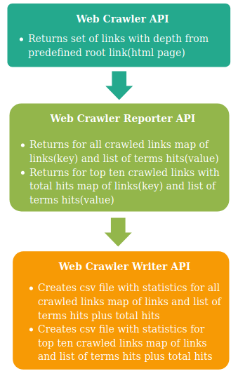
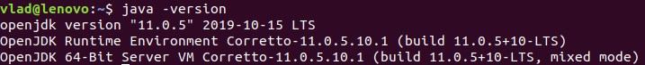
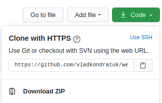
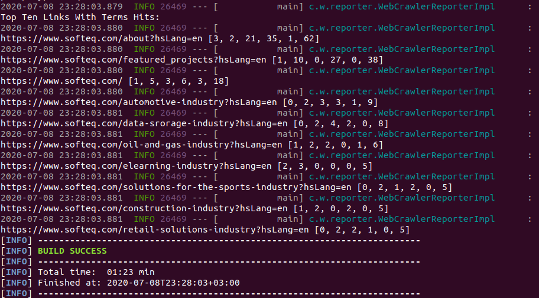

# Web-crawler

[](https://travis-ci.org/vladkondratuk/web-crawler)

## Project Idea

Implement Web-crawler that traverses websites following predefined link depth and max 
visited pages limit. The main purpose of this crawler to detect the presence of some terms on
the page and collect statistics, e.g.

### Project documentation
   
   #### Web crawler layers
   
    
   [Web-crawler implementation.](documentation/web-crawler_impl.md)
   
   [Web-crawler reporter implementation.](documentation/web-crawler-reporter_impl.md)
   
   [Web-crawler csv writer implementation.](documentation/web-crawler-writer_impl.md)

### Prerequisites
   
    install jdk 11 (LTS)
  
  For example OpenJDK 11 or Amazon Corretto 11.
  
  Check JDK version:
    
    $ java -version
    

  
### Installing

  Install with a git:
  
    $ git clone https://github.com/vladkondratuk/web-crawler.git
    
  Or install a ZIP archive:
    


### Setup configuration:
    
##### 1. After installing open directory with a project.
  
  If you installed project with a git: 
  
    $ cd web-crawler
  
  Or if you installed a ZIP archive:
    
    $ cd web-crawler-master 
  
##### 2. Properties explanation.
  
 There are 4 fields with default values.
  
 `crawler.properties`
 
```properties
    max.link.depth=2
    max.visited.pages=150
    root.link=https://www.softeq.com/
    terms.to.find=Product,Web,development,software,Full-stack
```

 Fields meaning:
  
 - `max.link.depth` - integer number that represent how deep crawler can traverse link. 
 Depth starts with `0(zero)` value that represent a `root.link`, `1`- depth for internals links 
 that was found for `root.link` and so on.
 - `max.visited.pages` - integer number that represent how much pages will be visited by a crawler. 
 `Visited pages` counts all visited links. Links can be repeated if, so they will not be 
 traversed but will be counted as `visited`. 
 - `root.link` - string of characters that represent root link for a crawler to start traversing.
 - `terms.to.find` - list of strings that represent `terms` for a crawler to find and count hits.
 `terms` - a word or phrase used to describe a thing.
      
##### 3. Set up fields with your values. 
 
 Go to [src/main/resources/crawler.properties](src/main/resources/crawler.properties).
 
### Running crawler

  Run terminal command in project directory:
  
    $ ./mvnw spring-boot:run
  
  After execution check [statistics](statistics) for terms hits report:
  
   - All statistics check [statistics/LinksWithTermHits.csv](statistics/LinksWithTermHits.csv).
   
   - Top ten total hits statistics check [statistics/LinksWithTopTenTermHits.csv](statistics/LinksWithTopTenTermHits.csv).
    
   Statistics for default values example:   
      
   ```csv
  link,Product,Web,development,software,Full-stack,total
  https://www.softeq.com/about?hsLang=en,3,2,21,35,1,62
  https://www.softeq.com/featured_projects?hsLang=en,1,10,0,27,0,38
  https://www.softeq.com/,1,5,3,6,3,18
  https://www.softeq.com/automotive-industry?hsLang=en,0,2,3,3,1,9
  https://www.softeq.com/data-srorage-industry?hsLang=en,0,2,4,2,0,8
  https://www.softeq.com/oil-and-gas-industry?hsLang=en,1,2,2,0,1,6
  https://www.softeq.com/elearning-industry?hsLang=en,2,3,0,0,0,5
  https://www.softeq.com/solutions-for-the-sports-industry?hsLang=en,0,2,1,2,0,5
  https://www.softeq.com/construction-industry?hsLang=en,1,2,0,2,0,5
  https://www.softeq.com/retail-solutions-industry?hsLang=en,0,2,2,1,0,5
  ```
  
  Successful execution example:
  
     

>Produced by Vladiskav Kondratuk 2020